# NUCLEO-STM32L552ZE-Q Trusted Firmware for Cortex-M (TF-M) Workbook

This workbook explains the necessary steps to create a secure TF-M base plltform.

The following material is using the [STMicroelectronics NUCLEO-STM32L552ZE-Q](https://www.st.com/en/evaluation-tools/nucleo-l552ze-q.html) development board. It explains how to set up a project in Arm Keil MDK (using STM32CubeMX for setting up the device) and the necessary configuration steps. It shows how to add an application that sends MQTT messages to the AWS cloud.

This is the list of steps:

- [Setting up the Hardware](#setting-up-the-hardware)
- [Setting up the Project](#setting-up-the-project)
- [Configuring the Device](#configuring-the-device)
- [Adding Software Components](#adding-software-components)
- [Configuring Software Components](#configuring-software-components)
- [Running the Application](#running-the-application)

*Prerequisites:*

- It is assumed that you have basic knowledge of the C programming language.
- The following software needs to be installed on your computer:
  - [Arm Keil MDK](https://www2.keil.com/mdk5/install/) (with a valid license for MDK-Essential/Plus/Professional; you can enable a [30-day trial license](https://www.keil.com/support/man/docs/license/license_eval.htm) from within Keil MDK)
  - [STMicroelectronics STM32CubeMX](https://www.st.com/en/development-tools/stm32cubemx.html)
  - [STMicroelectronics STM32CubeProgrammer](https://www.st.com/content/st_com/en/products/development-tools/software-development-tools/stm32-software-development-tools/stm32-programmers/stm32cubeprog.html)
- If you want to use this example project with Trusted Firmware for Cortex-M (TF-M), make sure that you finish the workbooks "NUCLEO-STM32L552ZE-Q AWS Secure Firmware" and "NUCLEO-STM32L552ZE-Q AWS Key Provisioning" first.

# Setting up the Hardware

The following describes the necessary steps to set up the development board hardware.

## Setting up the NUCLEO-STM32L552ZE-Q

There are no specific settings required for the example project to work on the development board. All jumpers should be set to the default locations. The chip itself requires some configuration with STM32CubeProgrammer, to be able to work with TF-M.

### Setting up the STM32L552ZET6Q

For the TF-M project, make sure that the following **Option bytes (OB)** are set using STM32CubeProgrammer:
- Read Out Protection - RDP: AA (Level 0, no protection)
- User Configuration - DBANK: Checked (Dual bank mode with 64 bits data)
- User Configuration - TZEN: Checked (Global TrustZone security enabled)
- Secure Area 1 - SECWM1_PSTRT - Value: 0x0, SECWM1_PEND - Value: 0x7f (Flash bank 1 secure: will be used for the TF-M project)
- Secure Area 2 - SECWM2_PSTRT - Value: 0x60, SECWM2_PEND - Value: 0x7f (Flash bank 2 non-secure: will be used for the AWS MQTT project; the last 64 kB secure: will be used for the client private key)

# Setting up the Project

> Before the actual project is created, make sure that all required software packs are downloaded and installed on you computer.

## Install CMSIS-Packs

Open  Pack Installer. Download and install the latest versions of the following software packs:

- **ARM.TFM** (2.0.0 or above) to add the Trusted Firmware for Cortex-M.
- **ARM.mbedCrypto** (3.0.1 or above) to add cryptographic extensions.
- **Keil.STM32L5xx_DFP** (1.2.0 or above) to add device support. 
- **Keil.STM32L5xx_TFM-PF** (1.0.0 or above) to add the TF-M platform support for STM32L5.

## Creating the Project

- Start µVision and go to **Project - New µVision Project...**
- Select your project directory and enter a meaningful project name, for example *TFM*:
  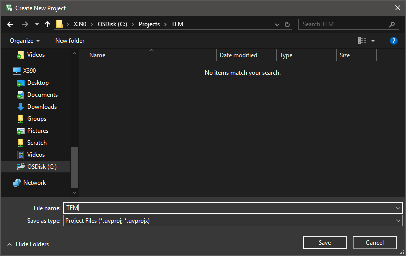
- Click *Save*.
- The device selection window opens. Enter *STM32L552ZE* in the **Search:** box and select the device *STM32L552ZETxQ*.
    
- Click *OK*.
- The Manage Run-Time Environment window opens.
- Go to *Device - STM32CUbe Framework (API) - STM32CubeMX* and enable it.
  
- Click *OK*.
- In the next window, click *Start STM32CubeMX* to run the application.

# Configuring the Device

STM32CubeMX opens with the device preconfigured and loaded:


## Configuring Pins

> For the correct operation of the low-power UART for displaying boot messages, you need to set the following.

On the **Pinout & Configuration** tab, go to **System Core - GPIO** and change the following GPIO pins:

|Name|Mode       |Label           |Output Level|Maximum Output Speed|
|----|-----------|----------------|------------|--------------------|
|PG7 |LPUART1_TX |N/A             |N/A         |N/A                 |
|PG8 |LPUART1_RX |N/A             |N/A         |N/A                 |

*Note:* The USART pins will be configured later (refer to [USART3](#usart3))

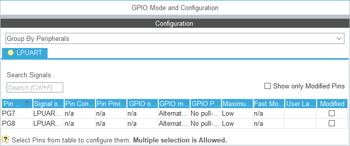

## Configuring NVIC

> For the correct operation of TF-M, preemption priorities have to be set right.

On the **Pinout & Configuration** tab, go to **Code generation** and disable the following handlers:

|Interrupt                              |Handler             |
|---------------------------------------|--------------------|
|Memory management fault                |Generate IRQ handler|
|Prefetch fault, memory access fault    |Generate IRQ handler|
|Undefined instruction or illegal state |Generate IRQ handler|
|System service call via SWI instruction|Generate IRQ handler|
|Pendable request for system service    |Generate IRQ handler|


## Configuring the Instruction Cache

> To speed up the overall processing time, we enable the instruction cache of the STM32L5.

On the **Pinout & Configuration** tab, go to **System Core - ICACHE** and set it to *2-ways set associative cache*:


## Configuring the LPUART1

> For displaying messages during device boot, the low-power USART interace has to be set up correctly.

On the **Pinout & Configuration** tab, go to **System Core - Connectivity - LPUART1** and set the **Mode** to *Asynchronous*. Under **Configuration - Parameter Settings**, change the **Baud Rate** to *115200*:

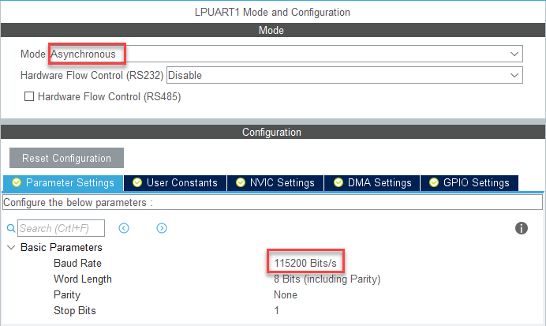

Under **Configuration - GPIO Settings**, change the **Maximum output speed** of the GPIO pins PG7 and PG8 to *Very High*:

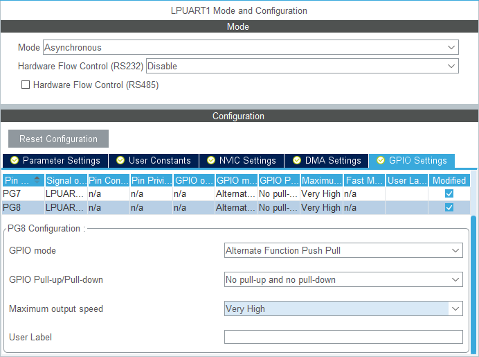

## Clock Configuration

> To achieve the right baud rates for the LPUART1, the clock setup needs to be changed.

On the **Clock Configuration** tab, change the **System Clock Mux** to use the *PLLCLK* and set the **N** multiplier to *55*:

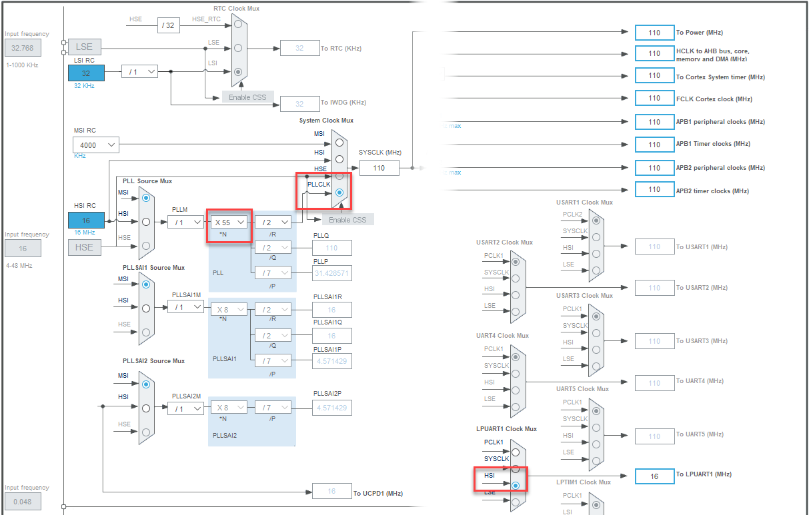

## Managing the Code Generation and Output

On the **Project Manager** tab, in the **Code Generator** section, enable *Add necessary library files as reference in the toolchain project configuration file*:


## Generate Code

Finally, press the **Generate Code** button and return to µVision:


Do not open the generated project, but just close STM32CubeMX now. Returning to the project is always possible using the  Play button in the **Manage Run-Time Environment** window of µVision.

µVision detects that the STM32CUbeMX configuration is done and asks to import the changes:

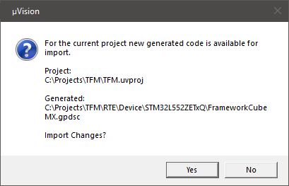

Click *Yes* to import the changes.

# Adding Software Components

## Setting up the Project

> Before adding the software components, there are some project setting that need to be done. As this is a Armv8-M based microcontroller, the correct [Software Model](https://www.keil.com/pack/doc/CMSIS/Core/html/using_TrustZone_pg.html) needs to be selected. As Arm Compiler 6 is quite verbose in the generation of warnings, we can set the verbosity to match the previous Arm Compiler 5.

Go to **Project - Options for Target (Alt+F7)** or use the target options button  and switch to the **Target** tab. In the **Code Generation** box, set the **Software Model** to *Secure Mode*.
  
  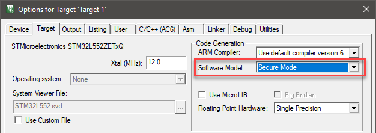

Go to the **C/C++ (AC6)** tab and select the following:
- **Warnings:** *AC5-like Warnings*

  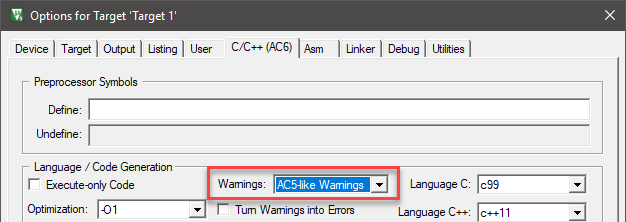

## Managing the Software Components

> In the following step, the required software components will be added.

Go to **Project - Manage - Run-Time Environment...** or press  to open the **Manage Run-Time Environment** window:


Select the following software components:

- ::CMSIS Driver:Flash (API):Custom
- ::CMSIS Driver:USART (API):Custom
- ::CMSIS:CORE
- ::TFM:Core, Variant: SFN
- ::TFM:Secure Service:Crypto
- ::TFM:Secure Service:Internal Trusted Storage, Variant: Encrypted
- ::TFM Platform:Memory Map
- ::TFM Platform:Crypto Keys (API): Dummy
- ::TFM Platform:SPM HAL (API): Platform

Use the **Resolve** button to add other required components automatically. The **Validation Output** should be empty.

# Configuring Software Components

> In this section, the software components that have been added to the project are configured to match the underlying hardware and software.

## Configuring Trusted Firmware for Cortex-M (TF-M)

> This example uses two services from TF-M that need to be enabled in the corresponding configuration file.

In the µVision **Project** window, under **TFM**, double-click the **tfm_config.h** file, and enter the following after the line `<<< end of configuration section >>>`:

```C
#define ITS_CREATE_FLASH_LAYOUT

#define TFM_CRYPTO_ENGINE_BUF_SIZE (0x4000)
```


In the µVision **Project** window, under **TFM Platform**, double-click the **flash_layout.h** file, and change the following (around line 157):

```C
/* The maximum asset size to be stored in the ITS area */
#define ITS_MAX_ASSET_SIZE      (2048)
/* The maximum number of assets to be stored in the ITS area */
#define ITS_NUM_ASSETS          (4)
```

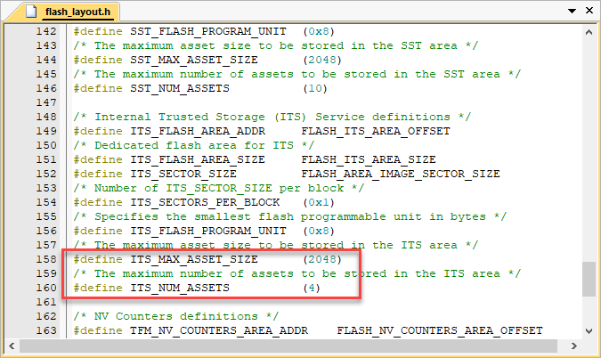

## Working on the Source Code

> Before you can build and run the application, some final changes in the source code need to be made.

### Adding CMSIS-Drivers

> We have selected custom CMSIS-Drivers for Flash and USART. In the next steps, you will add the custom code for these drivers.

- On your computer, find the repository for the STM32CubeMX FW packages. Usually, they are under C:\Users\username\STM32Cube\Repository\STM32Cube_FW_L5_Vx.x.x\. Go to the sub-directory .\Projects\NUCLEO-L552ZE-Q\Applications\SBSFU\SBSFU_Boot\Src. There, you find a file called `low_level_flash.c`. Copy this to your project directory.
  In the µVision **Project** window, right-click on **Source Group 1**, and select **Add Existing Files to Group 'Source Group 1'...**. In the next dialog, select the file and click *Add*:

  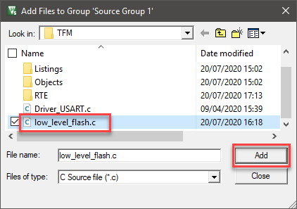

- Replace `#include "cmsis.h"` (around line 20) with the following:
  ```c
  #include "RTE_Components.h"
  #include CMSIS_device_header
  ```

- Add the following \#defines (around line 26):
  ```c
  #define FLASH_TOTAL_SIZE        (0x80000)
  #define FLASH_MANAGE_ICACHE
  ```

- Change the code of `is_erase_allow()` between `return` and `? (true) : (false);` (around line 124) to the following:
  ```c
      ((param >= FLASH_SST_AREA_OFFSET) && 
         (param < (FLASH_NV_COUNTERS_AREA_OFFSET + FLASH_NV_COUNTERS_AREA_SIZE)))
  ```

- Change the code of `Flash_ReadData()` between `endif` and the closing `}` (around line 281) to the following:
  ```c
      memcpy(data,(void*)((uint32_t)addr+FLASH_BASE), cnt);
      return ARM_DRIVER_OK;
  ```

- Change the code of `Flash_ProgramData()`. Replace `if (addr < FLASH_AREA_1_OFFSET)` until `else` (around line 320) by the following:
  ```c
      err = HAL_FLASH_Program(FLASH_TYPEPROGRAM_DOUBLEWORD, (FLASH_BASE+addr), dword);
  ```

- Change the code of `Flash_EraseSector()`. Replace `if (addr < FLASH_AREA_1_OFFSET)` until `else` (around line 368) by the following:
  ```c
    EraseInit.TypeErase = FLASH_TYPEERASE_PAGES;
  ```

- Change the name of the driver towards the end of the file (around line 420):
  ```c
  ARM_DRIVER_FLASH Driver_FLASH0 =
  ```

- Finally, delete all lines of code after line 434.

- In the µVision **Project** window, right-click on **Source Group 1**, and select **Add New Item to Group 'Source Group 1'...**. Select **User Code Template** and expand **CMSIS Driver**. Select **USART:Custom** and click *Add*:

  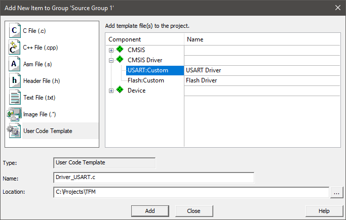

- Add the following \#defines at the beginning (around line 20):
  ```C
  #include "stm32l5xx_hal.h"
  #include "main.h"
  ```

- Update the `ARM_USART_Send` function (around line 97):
  ```C
      HAL_UART_Transmit(&hlpuart1, (uint8_t *)data, num, 1000U);
      return ARM_DRIVER_OK;
  ```

- At the end of the file, rename the exported driver to `Driver_USART1` (around line 139):
  ```C
  ARM_DRIVER_USART Driver_USART1;
  ARM_DRIVER_USART Driver_USART1 = {
  ```

### Changing main.h

Go to **File - Open (Ctrl+O)** and browse to .\RTE\Device\STM32L552ZETxQ\STCubeGenerated\Inc and open **main.h**. Add the following includes in the section `USER CODE BEGIN ET` (around line 40):
```c
extern UART_HandleTypeDef hlpuart1;
```

  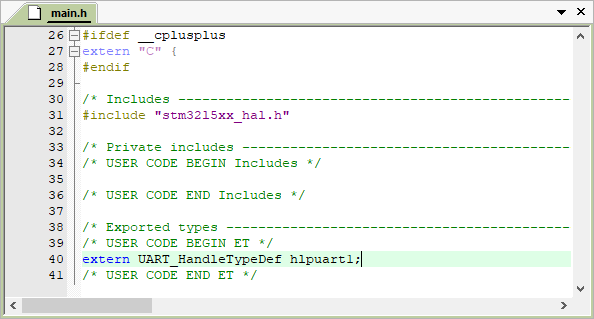

### Changing main.c

In the µVision **Project** window, under **STM32CubeMX: Common Sources**, double-click the **main.c** file and change the following:

- In the section `USER CODE BEGIN PD` (around line 35), add this:
  ```c
  #define main main0
  ```

- In the section `USER CODE BEGIN WHILE` (around line 98), comment out the endless loop and add a return statement:
  ```c
    /* USER CODE BEGIN WHILE */
  //  while (1)
  //  {
      /* USER CODE END WHILE */
  
      /* USER CODE BEGIN 3 */
  //  }
    return 0;
    /* USER CODE END 3 */
  ```

- In the section `USER CODE BEGIN 4` (around line 250), add the following initialization function that finally calls `main()`:
  ```c
  int tfm_spm_hal_post_init_platform (void)
  {
    main();
    return 0;
  }
  ```

### Updating the Startup File

In the µVision **Project** window, under **Device**, double-click the **startup_stm32l552xx.s** file and change the following:

- Change the `__initial_sp` vector (around line 62):
  ```assembly
  __Vectors       DCD     |Image$$ARM_LIB_STACK_MSP$$ZI$$Limit|              ; Top of Stack
  ```

- Add an import for this (around line 58):
  ```assembly
                  IMPORT  |Image$$ARM_LIB_STACK_MSP$$ZI$$Limit|
  ```

- Change the stack size to `0` (around line 32):
  ```assembly
  Stack_Size      EQU     0x00000400
  ```

- Change the `Reset_Handler` (around line 199):
  ```assembly
  Reset_Handler   PROC
                  EXPORT  Reset_Handler             [WEAK]
                  IMPORT  SystemInit
                  IMPORT  __main
  
                  LDR     R0, =SystemInit
                  BLX     R0
                  MRS     R0, control    ; Get control value
                  ORR     R0, R0, #2     ; Select switch to PSP
                  MSR     control, R0
                  LDR     R0, =__main
                  BX      R0
                  ENDP
  ```

### Updating the Linker (Scatter) File

> TF-M provides a common scatter file that needs to be used in the project.

Go to **Project - Options for Target (Alt+F7)** or use the target options button  and switch to the **Linker** tab:

1. Unselect **Use Memory Layout from Target Dialog**
2. Click on ... next to the **Edit** button.
3. Browse to .\RTE\TFM and select the file *tfm_common_s.sct* and click *Open*.
4. Add the following **Misc controls**:
   ```
   --import_cmse_lib_out="Objects/tfm_secure_fw_CMSE_Lib.o"
   --predefine="-include tfm_config.h"
   --predefine="-include tfm_config_rte.h"
   --predefine="-IRTE/_NUCLEO-L552ZE-Q/"
   --predefine="-IRTE/TFM_Platform/STM32L552ZETxQ/"
   --diag_suppress=L6312,L6314,L6329
   ```

   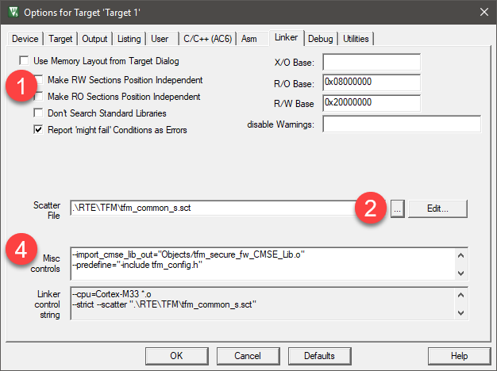

# Building the application

Go to **Project - Build Target (F7)** or use the build button  to start the compilation of the project. A successful build will show no errors or warnings (be sure to check your warning level as explained in (Setting up the Project)[#setting-up-the-project].

*Note:* If you are using this demo application together with the TF-M project, make sure that project is built first, as this example requires the CMSE library that is created during the build of the trusted firmware.

# Running the application

> Before running the application, you need to set the debug adapter and the correct trace frequency to see the `printf()` output in the **Debug (printf) Viewer** window of the µVision debugger.

## Target Driver Setup

Go to **Project - Options for Target (Alt+F7)** or use the target options button  and switch to the **Debug** tab:

1. Select to **Use:** the *ST-Link Debugger*
2. Press **Settings**:

   

The **Cortex-M Target Driver Setup** window opens. Make sure that in the **SW Device** box, an **IDCODE** is shown. Then, go to the **Trace** tab. Enter the following settings:

- Core Clock: *110 MHz* (as this is the correct core clock frequency; this setting is required to be able ot synchronize the **Debug (printf) Viewer** window output)
- Select **Trace Enable** (required for ITM trace which shows the `printf()` output)
- Make sure that **Use Core Clock** is selected (the device uses the same clock for trace)
- Disable **Timestamps** and **EXCTRC: Exception Tracing** (to reduce the load on the serial wire trace)
- Click *OK* twice.


## Flash Download

Go to **Flash - Download (F8)** or use the Flash download button  to transfer the application into the target's Flash memory.

*Notes:*

- If you are using this demo application together with the TF-M project, make sure that project is flashed first. Then, flash the key provisioning project and run it once. This is required to store the client private key in the internal secure storage (IST).
- If you encounter problems ("Error: Flash Download failed"), try to erase the Flash first, using **Flash - Erase**.

## Start Debugging

Go to **Debug - Start/Stop Debug Session (Ctrl+F5)** or use the debug button  to enter a debug session.

- To view the `printf()` messages, go to **View - Serial Windows - Debug (printf) Viewer** or use the debug viewer button .
- Go to **Debug - Run (F5)** or use the run button  to start the program execution.
