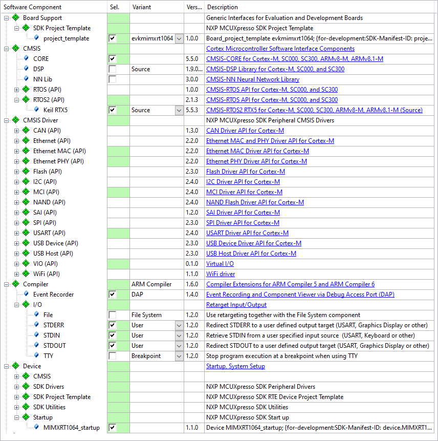
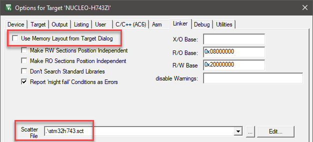
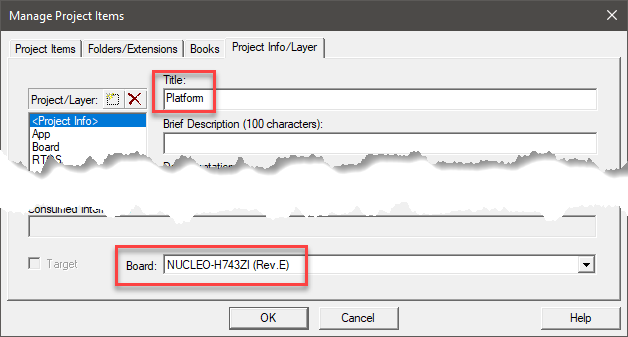
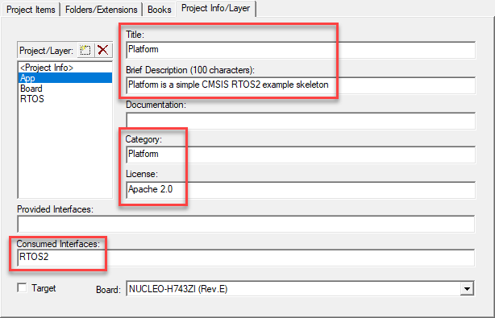
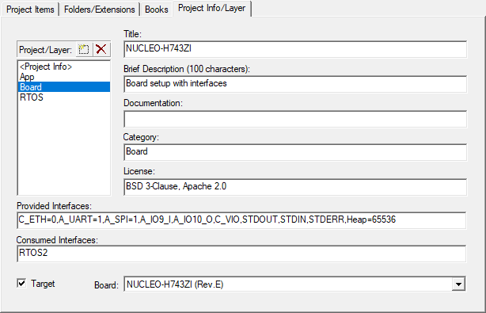
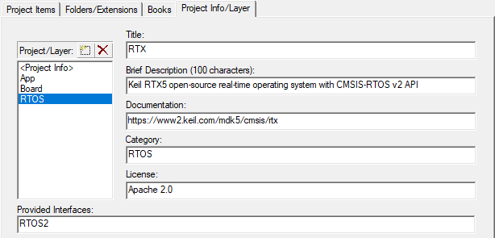
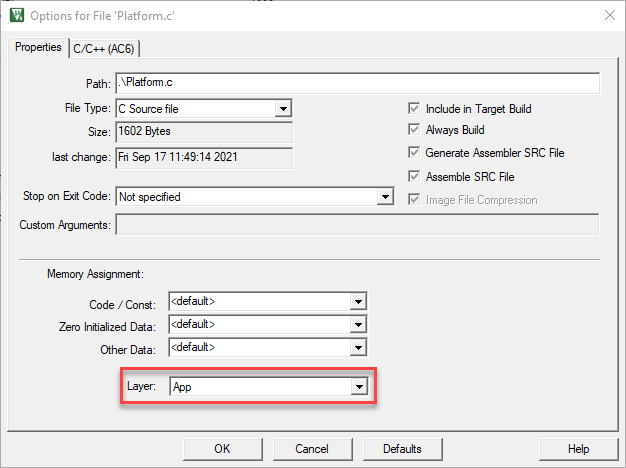

# How to create a platform project for a BSP

This document explains how to create a **platform** application for a board support pack (BSP) using Keil MDK. This project
can then be used to extract the board layer so that you can compose multiple project examples for the given BSP (refer to
[Layers for IoT Cloud Examples](https://github.com/MDK-Packs/CB_Lab4Layer#layers-for-iot-cloud-examples)).

The platform project configures the hardware of the development board and is a CMSIS-RTOS2, CMSIS-Drivers and EventRecorder
based software template that can be further expanded.

The following software is required:

- MDK v5.35 or above for creating the project and extracting the CPRJ file with layer information (the free MDK-Lite
  edition is sufficient)
- The following packs need to be installed:
  - ARM.CMSIS 5.7.0 or above
  - ARM.CMSIS-Driver 2.6.1 or above
  - Keil.ARM_Compiler 1.6.3 or above
  - Latest available software pack(s) that contain(s) device support (DFP/BSP)

## Create the Project

Start &micro;Vision and create a new project (refer to
[Setup the Project](https://www.keil.com/support/man/docs/uv4/uv4_ca_createprjfile.htm) for detailed information).

- Set project name to **Platform**.
- Select the device mounted on the development board as the current target.

### Select software components

Continue to select software components. The following components are required for the platform project (further components
might be required based on the device/board support pack):

- **CMSIS:CORE**
- **CMSIS:RTOS2 (API):Keil RTX5**, Variant: **Source** (you may also want to use any other CMSIS-RTOS2 compliant RTOS)
- **Compiler:Event Recorder**
- **Compiler:IO:STDERR**, Variant: **User**
- **Compiler:IO:STDIN**, Variant: **User**
- **Compiler:IO:STDOUT**, Variant: **User**
- **Device:Startup** (select other required components or click **Resolve** button)
- (Optional) For SMT32 devices, start the STM32CubeMX tool for device configuration via
  **Device:STM32Cube Framework (API):STM32CubeMX** button and use it to configure pinout and clock setup.
- (Optional) For NXP devices, use the MCUXpresso Config tool to configure pinout and clock setup.
- Select CMSIS-Drivers you want to support:
  - **CMSIS Driver:Ethernet MAC(API): Ethernet MAC**
  - **CMSIS Driver:Ethernet PHY(API): LAN8742A** (for example)
  - **CMSIS Driver:SPI(API):SPI**
  - **CMSIS Driver:UART(API):UART**
  - **CMSIS Driver:VIO(API):Board**, Variant: **'board name'**
- Board Support: select components as needed

  
RTE components selection example

### Add source code

In the next step, add source code template files for the platform project. The files are added to specific groups that are
later used to extract the layers from the project file.

These templates are available in the [templates](./templates) directory.

Go to **Project - Manage - Project Items...** and configure the project as follows:

- Under **Project Targets**, rename the target (usually **Target 1** to the actual **board name**).
- Under **Groups** add:
  - **App**: Platform.c (module where main thread application is running)
  - **Board IO**:
    - `arduino.c` (if an Arduino connector is available on the board, implement functions for set and get pin state here)
    - `arduino.h`
    - `retarget_stdio.c` (Implement functions to retarget stdio/stderr/stdout to the debug console here)
  - **Documentation**: `README.md` file (adopt these three parts: App, RTOS, Board)
  - **Board**:
    - `main.c`. Adapt the following the the actual hardware:
      - add `#include` statements
      - add board initialization functions. For NXP devices configured with MCUXpresso these are:
        ```
        BOARD_InitBootPins();
        BOARD_InitBootClocks();
        BOARD_InitDebugConsole();
        ```
      - add NVIC priority configuration
    - `main.h`
  - (STM32CubeMX specific) **STM32CubeMX:Common Sources**:
    - `main.c`. Adapt the following:
      - add these includes at `USER CODE BEGIN Includes`:
        ```
        #include "cmsis_os2.h"
        #include "RTE_Components.h"
        #ifdef    RTE_VIO_BOARD
        #include "cmsis_vio.h"
        #endif
        #if defined(RTE_Compiler_EventRecorder)
        #include "EventRecorder.h"
        #endif)
        ```
      - add functions to override the default `HAL_GetTick` and `HAL_InitTick` functions at `USER CODE BEGIN 0`:
        ```
        /**
        * Override default HAL_GetTick function
        */
        uint32_t HAL_GetTick (void) {
          static uint32_t ticks = 0U;
                 uint32_t i;
        
          if (osKernelGetState () == osKernelRunning) {
            return ((uint32_t)osKernelGetTickCount());
          }
        
          /* If Kernel is not running wait approximately 1 ms then increment 
             and return auxiliary tick counter value */
          for (i = (SystemCoreClock >> 14U); i > 0U; i--) {
            __NOP(); __NOP(); __NOP(); __NOP(); __NOP(); __NOP();
            __NOP(); __NOP(); __NOP(); __NOP(); __NOP(); __NOP();
          }
          return ++ticks;
        }
        
        /**
        * Override default HAL_InitTick function
        */
        HAL_StatusTypeDef HAL_InitTick (uint32_t TickPriority) {
          
          UNUSED(TickPriority);
        
          return HAL_OK;
        }
        ```
      - add this function at `USER CODE BEGIN SysInit`:
        ```
        SystemCoreClockUpdate();
        ```
      - add other initialization code at `USER CODE BEGIN 2`:
        ```
        #ifdef RTE_VIO_BOARD
          vioInit();
        #endif
        
        #if defined(RTE_Compiler_EventRecorder) && \
            (defined(__MICROLIB) || \
            !(defined(RTE_CMSIS_RTOS2_RTX5) || defined(RTE_CMSIS_RTOS2_FreeRTOS)))
          EventRecorderInitialize(EventRecordAll, 1U);
        #endif
        
          osKernelInitialize();                         /* Initialize CMSIS-RTOS2 */
          app_initialize();                             /* Initialize application */
          osKernelStart();                              /* Start thread execution */
        ```
  - (STM32CubeMX specific) **STM32CubeMX**: *.ioc (configuration file)
  - (MCUXpresso specific) **MCUXpresso**: *.mex (configuration file)

  
Manage Project Items Example

### Configure target options

The target options need to configured properly for a consistent user experience.

Go to **Project - Options for Target (Alt+F7)** and change:
- On the **Output** tab:
  - set the **Name of Executable** to "image":  
    
- On the **C/C++(AC6)** tab:
  - Set **Optimization:** to *-O1*
  - Set **Warnings:** to *AC5-like Warnings*
  - Select **One ELF Section per Function** checkbox
  - Add **Include Paths:** `.\Board_IO` (if `arduino.c` is available):  
    
- On the **Linker** tab:
  - Deselect **Use Memory Layout from Target Dialog**
  - Select a scatter file (which should place EventRevorder in Zero Initialized Data area):  
    
- On the **Debug** tab:
  - Select a suitable debugger (CMSIS-DAP or ST-Link Debugger or example):  
    

### Configure other project settings

Other project settings need to be configured at different places.

Configure following items:

- In a device specific file (usually `startup_device.s/c`), set:
  - **Heap Size** to *64 KB*
  - **Stack Size** to *1 KB*
- In the `RTX_Config.h` file, set:
  - **Global Dynamic Memory size** to *32768* bytes
  - **Default Thread Stack size** to *3072* bytes
  - Under **Event Recorder Configuration**, set:
    - **Global Initialization** to *1*
    - **Start Recording** to *1*
- In the `RTE_Device.h` file (if available), configure device specific driver interfaces.

### Add layer information

In the next step, add the layer information for the platform project.

Go to **Project - Manage - Project Items... - Project Info/Layer tab** and annotate the layer information:

- **\<Project Info>**, set **Title** to *Platform*
- At the bottom, select the correct **Board**:  
  
- Add the following layers:
  - **App** and set:
    - **Title** to *Platform*
    - **Brief Description** to *Platform is a simple CMSIS RTOS2 example skeleton*
    - **Category** to *Platform*
    - **License** to *Apache 2.0* (recommended, but can be set to you preferred license)
    - **Consumed Interfaces** to *RTOS2*:  
      
  - **Board** and set:
    - **Title** to *'board name'*
    - **Brief Description** to *Board setup with interfaces*
    - **Category** to *Board*
    - **License** to *BSD 3-Clause, Apache 2.0*
    - **Provided interfaces** to:
      - for CMSIS driver interfaces: *C_ETH=X,C_MCI=X,SPI=X,C_VIO* (X stands for the CMSIS-Driver interface number)
      - for Arduino driver interfaces: *A_UART=X,A_SPI=X* (X stands for the CMSIS-Driver interface number)
      - for Arduino D9 and D10 pins: *A_IO9_I,A_IO10_O*
      - for Retarget output/input: *STDOUT,STDIN,STDERR*
      - as Heap size: *Heap=65536*
    - **Consumed Interfaces** to *RTOS2*
    - Select the **Target** checkbox:  
      
  - **RTOS** and set (this might be different for other CMSIS-RTOS2 operating systems):
    - **Title** to *RTX*
    - **Brief Description** to *Keil RTX5 open-source real-time operating system with CMSIS-RTOS v2 API*
    - **Documentation** to *https://www2.keil.com/mdk5/cmsis/rtx*
    - **Category** to *RTOS*
    - **Licence** to *Apache 2.0*
    - **Provided Interfaces** to *RTOS2*  
      

*Note*:

The provided and consumed interfaces are used to determine the suitability of a certain combination of layers when composing
a project. The number of consumed interfaces must be equal of less the number of provided interfaces.

### Assignment of files and components to layers

In the **Project** window, all project files (not folders) and software components need to be assigned to the respective
layers so that they can be extracted correctly.

Add the following:
- To **App** layer:
  - App
  - Documentation
- To **Board** layer:
  - Board IO
  - Board
  - STM32CubeMX:Common Sources(STM32CubeMX specific)
  - Board Support
  - CMSIS-Core components
  - CMSIS Driver
  - Compiler components
  - Device components
- To **RTOS** layer: CMSIS-RTOS2 components

To assign files that are not part of a software component, right-click a file and select **Options for File...**. Then, select the right **Layer:** at the bottom of the **Properties** tab:  


To assign software components, right-click a component and select **Options for Component Class...**. Click on the component you wish to assign and on the **Properties** tab, select the right **Layer:**:  


### Separate the Markdown files for the layers

Each layer carries its own Markdown file that contains the relevant information about the layer. When composing a project,
the layer Markdown files are concatenated to compose the project's `README.md` file. This, you need to create the separate
Markdown files when creating the platform project.

Create three additional files:

- For the **App** layer, create layer.App.md.
- For the **RTOS** layer, create layer.RTOS.md.
- For the **Board** layer, create layer.Board.md.

These layer documentation files contain information about the configuration of the layer itself. Examples are available in
the directories of the different [layers](../layer).

### Create the CPRJ file

Finally, create a CPRJ file that contains all the information about the layers and the overall project. This is then used in
here to separate the layers and to compose new projects for a given development board from the list of layers.

Go to **Project - Export - Save Project to CPRJ format** to generate a Platform.cprj file.
